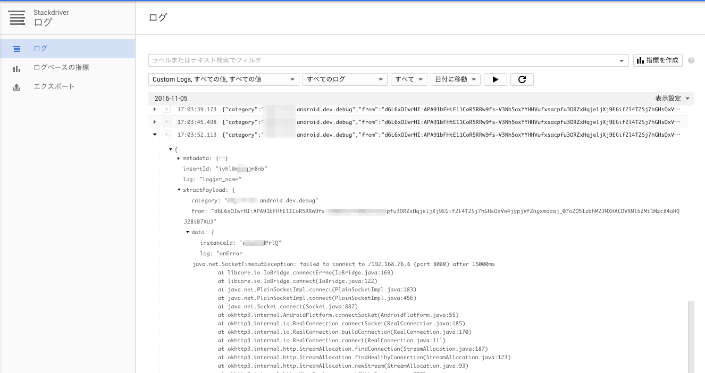
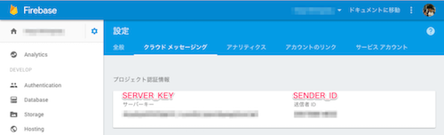

Android of the log is a project to be able to display in StackDriver of GCP.
Logs are sent to the XMPP server in the GCM, and sends it to the StackDriver Log of GCP.

AndroidのログをGCPのStackDriverで表示できるようにするプロジェクトです。
ログはGCMでXMPPサーバーに送信され、GCPのStackDriver Logに送ります。

`Android -> GCM -> XMPP -> StackDriver`

need 
1. create Log Forward Server
2. Android log setting



#create Log forward Server

## dependencies
### docker
[Install Docker Engine - Docker](https://docs.docker.com/engine/installation/)
### gcloud
[Installing Cloud SDK  |  Cloud SDK Documentation  |  Google Cloud Platform](https://cloud.google.com/sdk/downloads)

## require settings
### if use Google Compute Engine
#### GCP Network
network port tcp:8080 grpc
https://cloud.google.com/solutions/mobile/mobile-compute-engine-grpc

## download
```
wget https://raw.githubusercontent.com/shikajiro/xmpp_gcm/master/xmpp.py
```

### edit xmpp.py
```xmpp.py
SENDER_ID = 'your FCM sender id'
SERVER_KEY = 'your FCM server key'
```



## xmpp start from docker (example GCP)
```
gcloud auth login
docker-machine create -d google \
     --google-project example \
     --google-zone asia-northeast1-c \
     --google-machine-type "f1-small" \
     --google-machine-image https://www.googleapis.com/compute/v1/projects/debian-cloud/global/images/debian-8-jessie-v20161027 \
     xmpp
eval $(docker-machine env xmpp)
docker run --name xmpp_gcm -d shikajiro/xmpp_gcm # this image need xmpp.py
```

Let's start Logging Server !!

### docker log
```
docker logs test-xmpp_gcm -f
```

# Android log setting
need fcm(gcm) send process.
## Log Setting Example (if use Timber)

```
    override fun onCreate() {
        super.onCreate()
        Timber.plant(DebugLogTree())
    }

    private class DebugLogTree : Timber.DebugTree() {
        override fun log(priority: Int, tag: String, message: String, t: Throwable?) {
            super.log(priority, tag, message, t)

            if (priority == Log.VERBOSE || priority == Log.DEBUG || priority == Log.INFO) {
                Observable.create<Unit> {
                    val instanceId = FirebaseInstanceId.getInstance().id
                    val fm = FirebaseMessaging.getInstance()
                    // not ui thread.
                    fm.send(RemoteMessage
                            .Builder(SENDER_ID + "@gcm.googleapis.com")
                            .setMessageId(instanceId + DateTime.now().toString("yyyyMMddHHmmss"))
                            .setMessageType("log")
                            .addData("log", message)
                            .addData("instanceId", instanceId)
                            .addData("priority", ""+priority)
                            .addData("tag", tag)
                            .build())
                }.subscribe {

                }
            }
        }
    }
```
